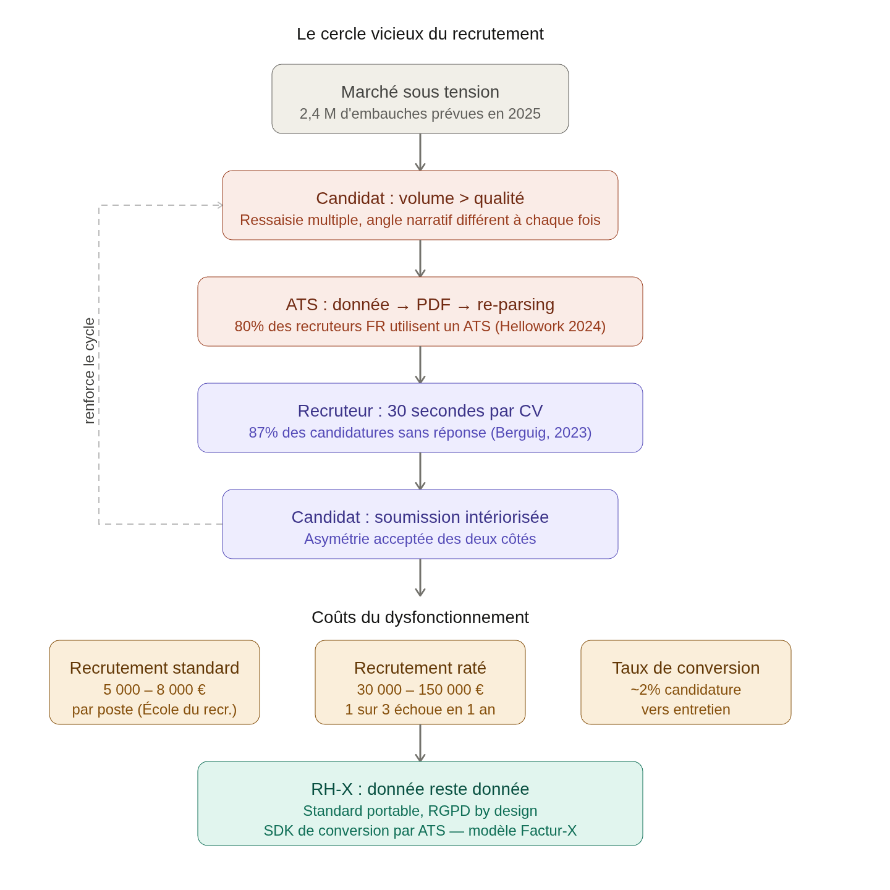

# Les coûts du marché

## Les coûts du recrutement

Le coût moyen d'un recrutement en France se situe entre 5000 et 8000€ pour un profil standard recruté en interne et entre 15 et 30% du Salaire Annuel Brut quand un cabinet de recrutement ou un chasseur de tête est mobilisé. Pour un cadre dirigeant, la facture peut rapidement grimper à 25-60k€. _Source : [Optima Industrie](https://optima-industrie.com/cout-recrutement/)_

Un recrutement raté peut coûter entre 30 et 150k€ selon le profil. On estime qu'un recrutement sur sept échoue pendant la période d'essai et un sur trois sur un an (prêt d'un sur deux pour les moins de 24 ans). _Source : [Talent Program](https://www.talentprogram.fr/cout-recrutement/)_

## Volume et tension du marché

En 2024, les difficultés de recrutement étaient principalement attribuées à des problèmes de candidatures : 75 % des établissements mentionnaient des candidatures inadéquates et 68 % un nombre de candidatures insuffisantes. _Source : [franceinfo.fr](https://www.franceinfo.fr/economie/emploi/les-intentions-de-recrutement-sont-en-baisse-de-12-5-en-2025-selon-france-travail_7183803.html)_

En 2023, 61 % des recrutements étaient jugés difficiles. En 2026, cette proportion descend à 44 %, ce qui reste considérable. _Source : [Parlonsrh](https://www.parlonsrh.com/recrutement-2026-une-dynamique-en-baisse-des-tensions-toujours-presentes/)_

## Le mur du silence

Selon CV Genius qui cite un article de @FranckBerguig qui parlait des recherche de stage/apprentissage, 87% des candidats ne recevront jamais de réponse (en 2023). _Source: [cvgenius](https://cvgenius.com/fr/blog/conseils-carriere/statistiques-marche-de-lemploi), [FranckBerguig](https://www.linkedin.com/pulse/87-des-candidatures-ne-recevront-jamais-de-r%C3%A9ponse-franck-berguig/)_

## L'ATS, absurdité du moment

Selon l'étude Hellowork 2024, 80 % des recruteurs français utilisent ou envisagent d'adopter un ATS. Son pipeline tient en deux opérations : le parsing pour extraire les données du CV, puis le scoring pour comparer ces données à l'annonce publiée. _Source : [aecom](https://www.aecom.org/comment-les-logiciels-ats-analysent-votre-cv-et-pourquoi-tant-de-candidatures-sont-rejetees-avant-lecture/)_

Chaque offre d'emploi attire en moyenne 250 candidatures. Parmi elles, seulement 4 à 6 débouchent sur un entretien, soit un taux de passage d'environ 2%. _Source : [Cletia](https://www.cletia.fr/article/stats-traitement-cv-2025/)_

## Ce que ces chiffres démontrent

Le système dépense entre 5 000 et 8 000 euros par recrutement, échoue une fois sur trois dans l'année, et filtre automatiquement des données qu'il a lui-même dégradées en les faisant transiter par un document PDF. 87 % des candidats n'ont aucun retour. C'est le business case de RH-X en creux : chaque point de friction éliminé dans la chaîne de données est de l'argent récupéré et de la qualité restaurée.

